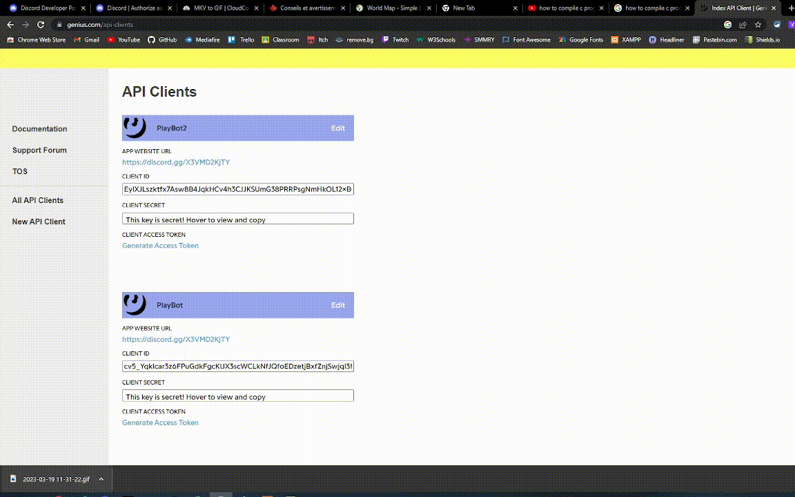

<p align="center">
  <picture>
    

  </picture>
</p>

<div align="center">


[](https://img.shields.io/tokei/lines/github/W1L7dev/Devbot?style=for-the-badge)


</div>

---

DevBot is a personal Discord bot designed to manage my Discord server, but it can be used for any server. It has a variety of features, including moderation, fun, and utility commands. It also has a leveling system, which allows users to gain experience and level up. The bot is written in Python using the nextcord library. It is currently in development, and new features are being added regularly. If you have any suggestions, feel free to open an issue or pull request.

## Table of Contents

- [Table of Contents](#table-of-contents)
- [Installation \& Running](#installation--running)
- [Features \& Commands](#features--commands)
- [Contributing](#contributing)
- [Contact](#contact)

## Installation & Running

To install and use the bot, you'll need the following tools:

- [Python 3.11 or newer](https://www.python.org/downloads/)
- [Git](https://git-scm.com/downloads)
- [Java 16 or newer](https://www.java.com/en/download/)
- [PIP](https://pip.pypa.io/en/stable/installation/)

You'll also need to install [Lavalink](https://github.com/freyacodes/Lavalink), but it is included in the repository.

First, You'll need to create a Discord Application. First, head to the [Discord Developer Portal](https://discord.com/developers/applications), and create a new application.

<p align="center">
  <picture>
    
  </picture>
</p>

After, you'll need to create a Genius API account. To do this, head to the [Genius API website](https://genius.com/api-clients) and create a new application.

<p align="center">
  <picture>
    
  </picture>
</p>

Then, you may install the repository. To do this, open a terminal and run the following commands:

```bash
git clone https://github.com/W1L7dev/Devbot.git
```

Once the repository is cloned, you'll need to install the dependencies. To do this, run one of the following commands:

```bash
pip install -r requirements.txt
```

> **Note**
> Use `python -m`, `pip3` or similar if that is how you install your pakages
> Generally, Windows uses `py -m` and UNIX machines `python3 -m`

Then, you can open a text editor such as Visual Studio Code, Visual Studio, Sublime Text or Jetbrains IDEs, and open the file in the src\ directory called `.env`, inside of it, you'll need to paste your bot's token and your genius api key.

```env
TOKEN=your_bot_token
GENIUS=your_genius_api_key
```

When you'll need to run the bot, make sure to run Lavalink first. To do this, open a terminal and run the following commands:

```bash
cd plugins/Lavalink
java -jar Lavalink.jar
```

Before running the bot, Make sure to check if all python files have the correct path.

Then, you can run the bot. To do this, open src/devbot.py and run it.
Alternatively, you can run the bot from the terminal. To do this, open a terminal and run one of the following commands:

```bash
cd src
py main.py
```

> **Note**
> You can use `python`, `py3` or similar instead of `py` if it doesn't work

---

## Features & Commands

DevBot has a variety of features, including moderation, fun, and utility commands. It also has a leveling system, which allows users to gain experience and level up. The bot is written in Python using the nextcord library. It is currently in development, and new features are being added regularly. If you have any suggestions, feel free to open an issue or pull request.

| #   | Command Name      | Description                                     | Usage                                                             | Category       |
| --- | ----------------- | ----------------------------------------------- | ----------------------------------------------------------------- | -------------- |
| 1   | `category create` | Creates a new category with the specified name. | `/category create <name>`                                         | Administration |
| 2   | `category delete` | Deletes the specified category.                 | `/category delete <name>`                                         | Administration |
| 3   | `category move`   | Moves a channel to a specified category         | `/category move <channel>`                                        | Administration |
| 4   | `channel create`  | Creates a new channel with the specified name.  | `/channel create <name>`                                          | Administration |
| 5   | `channel delete`  | Deletes the specified channel.                  | `/channel delete <name>`                                          | Administration |
| 6   | `role add`        | Adds a role to the specified user.              | `/role add <user> <role>`                                         | Administration |
| 7   | `role create`     | Creates a new role with the specified name.     | `/role create <name>`                                             | Administration |
| 8   | `role delete`     | Deletes the specified role.                     | `/role delete <name>`                                             | Administration |
| 9   | `role remove`     | Removes a role from the specified user.         | `/role remove <user> <role>`                                      | Administration |
| 10  | `role rename`     | Renames the specified role.                     | `/role rename <name>`                                             | Administration |
| 11  | `uptime`          | Displays the bot's uptime.                      | `/uptime`                                                         | Development    |
| 12  | `cls`             | Clears the terminal output.                     | `/cls`                                                            | Development    |
| 13  | `print`           | Prints a message to the terminal.               | `/print <message>`                                                | Development    |
| 14  | `restart`         | Restarts the bot.                               | `/restart`                                                        | Development    |
| 15  | `shutdown`        | Shuts down the bot.                             | `/shutdown`                                                       | Development    |
| 16  | `cog`             | Loads, unloads, or reloads a cog.               | `/cog <load,unload,reload> <name> <type>`                         | Development    |
| 17  | `activity`        | Sets the bot's activity.                        | `/activity <name>`                                                | Development    |
| 18  | `status`          | Sets the bot's status.                          | `/status <online,idle,dnd,invisible>`                             | Development    |
| 19  | `file read`       | Reads a file.                                   | `/file read <path>`                                               | Development    |
| 20  | `file create`     | Creates a file.                                 | `/file create <path>`                                             | Development    |
| 21  | `file write`      | Writes to a file.                               | `/file write <path> <message>`                                    | Development    |
| 22  | `file delete`     | Deletes a file.                                 | `/file delete <path>`                                             | Development    |
| 23  | `folder create`   | Creates a folder.                               | `/folder create <path>`                                           | Development    |
| 24  | `folder delete`   | Deletes a folder.                               | `/folder delete <path>`                                           | Development    |
| 25  | `folder list`     | Lists the contents of a folder.                 | `/folder list <path>`                                             | Development    |
| 26  | `eval`            | Evaluates Python code.                          | `/eval <expression>`                                              | Development    |
| 27  | `log`             | Logs a message to the terminal.                 | `/log <debug,info,warning,error,critical,success,fail> <message>` | Development    |
| 28  | `8ball`           | Asks the magic 8ball a question.                | `/8ball <question>`                                               | Fun            |
| 29  | `coinflip`        | Flips a coin.                                   | `/coinflip`                                                       | Fun            |
| 30  | `dice`            | Rolls a dice.                                   | `/dice`                                                           | Fun            |
| 31  | `rps`             | Plays rock, paper, scissors.                    | `/rps <rock,paper,scissors>`                                      | Fun            |
| 32  | `choose`          | Chooses between multiple options.               | `/choose <option1,option2...>`                                    | Fun            |
| 33  | `slots`           | Plays the slots.                                | `/slots`                                                          | Fun            |
| 34  | `ruin`            | Ruins text.                                     | `/ruin <text>`                                                    | Fun            |
| 35  | `morse`           | Converts text to morse code.                    | `/morse <text>`                                                   | Fun            |
| 36  | `reverse`         | Reverses text.                                  | `/reverse <text>`                                                 | Fun            |
| 37  | `rules`           | Displays the server rules.                      | `/rules`                                                          | Informations   |
| 38  | `userinfo`        | Displays information about a user.              | `/userinfo <user>`                                                | Informations   |
| 39  | `serverinfo`      | Displays information about the server.          | `/serverinfo`                                                     | Informations   |
| 40  | `roleinfo`        | Displays information about a role.              | `/roleinfo <role>`                                                | Informations   |
| 41  | `channelinfo`     | Displays information about a channel.           | `/channelinfo <channel>`                                          | Informations   |
| 42  | `rank`            | Displays your rank.                             | `/rank <member>`                                                  | Levelling      |
| 43  | `leaderboard`     | Displays the server leaderboard.                | `/leaderboard`                                                    | Levelling      |
| 44  | `reset`           | Resets your rank.                               | `/reset`                                                          | Levelling      |
| 47  | `raidmode`        | Toggles raidmode.                               | `/raidmode <True,False>`                                          | Moderation     |
| 48  | `lock`            | Locks a channel.                                | `/lock <channel>`                                                 | Moderation     |
| 49  | `unlock`          | Unlocks a channel.                              | `/unlock <channel>`                                               | Moderation     |
| 50  | `slowmode`        | Sets the slowmode of a channel.                 | `/slowmode <channel> <time>`                                      | Moderation     |
| 51  | `ban`             | Bans a user.                                    | `/ban <user> <reason>`                                            | Moderation     |
| 52  | `unban`           | Unbans a user.                                  | `/unban <user>`                                                   | Moderation     |
| 53  | `kick`            | Kicks a user.                                   | `/kick <user> <reason>`                                           | Moderation     |
| 54  | `clear`           | Clears messages.                                | `/clear <amount>`                                                 | Moderation     |
| 55  | `timeout`         | Timeouts a user.                                | `/timeout <user> <time> <reason>`                                 | Moderation     |
| 56  | `warn`            | Warns a user.                                   | `/warn <user> <reason>`                                           | Moderation     |
| 57  | `warnings`        | Displays a user's warnings.                     | `/warnings <user>`                                                | Moderation     |
| 58  | `clearwarns`      | Clears a user's warnings.                       | `/clearwarns <user>`                                              | Moderation     |
| 59  | `removewarn`      | Removes a warning from a user.                  | `/removewarn <user> <id>`                                         | Moderation     |
| 60  | `play`            | Plays a song.                                   | `/play <song>`                                                    | Music          |
| 61  | `pause`           | Pauses the music.                               | `/pause`                                                          | Music          |
| 62  | `resume`          | Resumes the music.                              | `/resume`                                                         | Music          |
| 63  | `volume`          | Changes the volume.                             | `/volume <volume>`                                                | Music          |
| 64  | `nowplaying`      | Displays the current song.                      | `/nowplaying`                                                     | Music          |
| 65  | `stop`            | Stops the music.                                | `/stop`                                                           | Music          |
| 66  | `connect`         | Joins a voice channel.                          | `/connect`                                                        | Music          |
| 67  | `disconnect`      | Disconnects from a voice channel.               | `/disconnect`                                                     | Music          |
| 68  | `lyrics`          | Displays the lyrics of a song.                  | `/lyrics <song>`                                                  | Music          |
| 69  | `poll`            | Creates a poll.                                 | `/poll <question> <choice1,choice2...>`                           | Poll           |
| 70  | `pollresults`     | Displays the results of a poll.                 | `/pollresults <message id>`                                       | Poll           |
| 71  | `ping`            | Displays the bot's ping.                        | `/ping`                                                           | Utils          |
| 72  | `say`             | Makes the bot say something.                    | `/say <message>`                                                  | Utils          |
| 73  | `embed`           | Makes the bot send an embed.                    | `/embed <title> <description>`                                    | Utils          |
| 74  | `nick`            | Changes your nickname.                          | `/nick <nickname>`                                                | Utils          |
| 75  | `resetnick`       | Resets your nickname.                           | `/resetnick`                                                      | Utils          |
| 76  | `avatar`          | Displays a user's avatar.                       | `/avatar <user>`                                                  | Utils          |
| 77  | `giveaway`        | Creates a giveaway.                             | `/giveaway <time> <winners> <prize>`                              | Utils          |
| 78  | `ticket`          | Creates a ticket message.                       | `/ticket <message id>`                                            | Utils          |
| 79  | `math`            | Evaluates a mathematical expression.            | `/math <expression>`                                              | Math           |

Made with ❤️ by W1L7dev 💻

## Contributing

Pull requests are welcome. For major changes, please open an issue first to discuss what you would like to change. More informations in [CONTRIBUTING.md](CONTRIBUTING.md)

Code of Conduct in [CODE_OF_CONDUCT.md](CODE_OF_CONDUCT.md)

Contributors in [CONTRIBUTORS.md](CONTRIBUTORS.md)

---

## Contact

Discord: W1L7#9944

Email: w1l7dev@gmail.com

Website: https://w1l7dev.github.io/W1L7/

⬇️⬇️ **[DevLabs](https://discord.gg/aGbpGEDqnT)** ⬇️⬇️


